# NYC Taxi High-Tip Classifier — End-to-End MLOps

An end-to-end MLOps system that predicts whether a New York City taxi trip
will yield a **high tip** (more than 20% of the fare), built to production
standards: versioned training, a model registry with automatic promotion,
a containerized serving API, data-drift monitoring, an operations
dashboard, and a CI/CD pipeline.

The emphasis of this project is **the engineering around the model**, not
the model's raw accuracy. The prediction target was deliberately kept
honest (no label leakage), which makes it genuinely hard — and that choice
is itself part of the story (see *Modeling honesty* below).

**Author:** Diego Leonardo Alves de Andrade
**Live dashboard:** _<add Streamlit Cloud link here>_
**Repository:** https://github.com/DiegoTDDD/nyc-tip-mlops

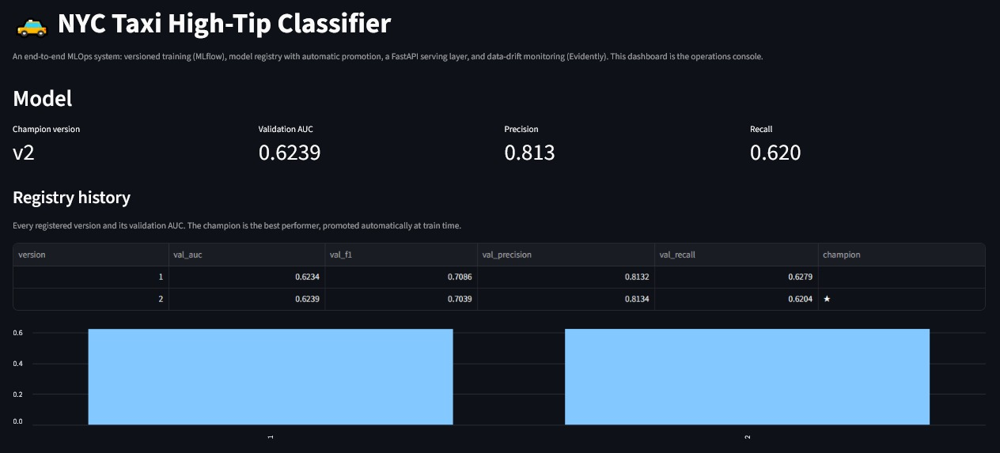

---

## What this demonstrates

| Capability | How it shows up here |
|---|---|
| Feature engineering without leakage | Credit-card-only filter, target-encoded zones fit on train only |
| Versioned training | Every run logged to MLflow (params, metrics, plots, artifacts) |
| Model registry + promotion | `nyc_tip_classifier` with a `champion` alias, promoted automatically when a new run beats the incumbent |
| Hyperparameter search | 12-combination grid, each a nested MLflow run |
| Model serving | FastAPI service that loads the champion straight from the registry and reproduces the exact training-time feature engineering |
| Data-drift monitoring | Evidently report comparing 2024 (reference) vs 2025 (current) |
| Containerization | Docker Compose running the API and the MLflow UI together |
| CI/CD | GitHub Actions: unit tests on every push, scheduled automated retraining |
| Operations dashboard | Streamlit console: champion metrics, registry history, drift status, live prediction |

---

## Architecture

```
NYC Taxi parquet (2024 train / 2025 production)
        │
        ▼
  Feature engineering  ──►  features/train.parquet      (model features, no leakage)
        │                   monitoring/*_snapshot.parquet (full population for drift)
        ▼
  Training (XGBoost)  ──►  MLflow tracking + registry  ──►  champion alias
        │                        │
        │                        ▼
        │                  FastAPI /predict  (loads champion from registry)
        ▼
  Evidently drift report  ──►  monitoring/drift_summary.json
        │
        ▼
  Streamlit dashboard  (metrics + registry + drift + live prediction)

  Docker Compose: API (8000) + MLflow UI (5000)
  GitHub Actions: tests on push, scheduled retrain
```

---

## The problem and the data

The model predicts, at the moment a trip begins, whether the rider will
tip more than 20% of the fare. The data is the public NYC TLC Yellow Taxi
trip records: **January 2024** as the training reference and **January
2025** as the production/drift period (the month following NYC's
congestion-pricing rollout).

### Modeling honesty (no leakage)

Cash trips almost never record a tip, so `payment_type` trivially predicts
"no tip". Leaving it in would produce a deceptively high score that any
reviewer would recognize as leakage. Instead the model trains **only on
credit-card trips** and never sees the payment channel. It must predict
*who* tips well from trip characteristics known at pickup time: distance,
duration, hour, day of week, passenger count, and pickup/dropoff zone.

This is a genuinely hard signal — tipping is idiosyncratic — so the honest
ceiling is low (validation AUC ≈ 0.62). The hyperparameter search confirmed
that deeper, larger models *overfit* and generalized worse, which is itself
evidence that the simple model is the right one. In a portfolio context an
honest 0.62 with a clean pipeline is worth more than a leaky 0.99.

### Features

| Feature | Notes |
|---|---|
| `trip_distance` | miles |
| `trip_duration_min` | from pickup/dropoff timestamps |
| `avg_speed_mph` | distance / duration, capped at 80 |
| `pickup_dayofweek`, `is_weekend` | calendar features |
| `hour_sin`, `hour_cos` | cyclical encoding of pickup hour |
| `pu_zone_tip_rate`, `do_zone_tip_rate` | smoothed target-encoding of zones, **fit on the training split only** to avoid leakage |

---

## Versioned training & model registry (MLflow)

Every training run is logged to MLflow with its parameters, metrics, and
diagnostic plots. The two entry points (`train.py` and `train_v2.py`) each
register a new version of `nyc_tip_classifier`, and the best run is promoted
to the `champion` alias automatically — that alias is what the serving layer
loads, so promotion is the single source of truth for "what's in production".

**Training runs — versions, sources, and registered models**
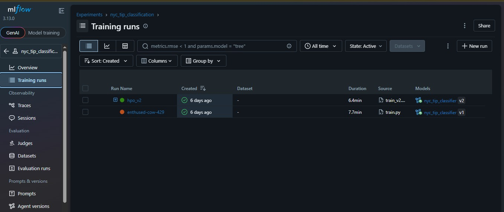

The richer trainer runs a 12-combination hyperparameter search, each
combination logged as a nested child run so they can be compared side by side.

**Hyperparameter-search run — metrics and nested child runs**
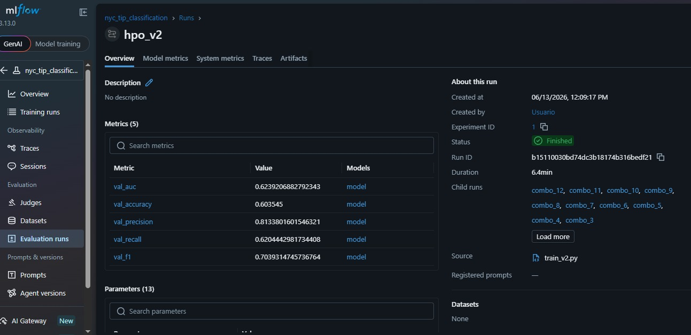

**Model registry — the `champion` alias points at the best version**
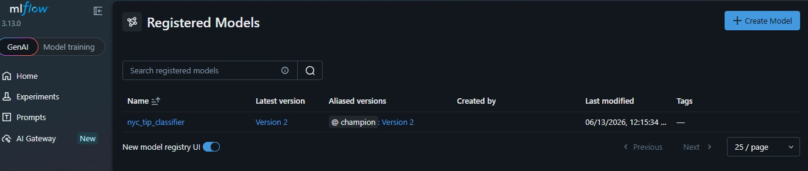

---

## Results

- **Champion:** `nyc_tip_classifier` v2 (XGBoost), promoted automatically.
- **Validation:** AUC ≈ 0.624, precision ≈ 0.813, recall ≈ 0.620, F1 ≈ 0.704.
- **Drift:** between 2024 and 2025 the model's input features were stable,
  but the **payment-type mix drifted** (the "unknown" share roughly tripled,
  4% → 13%) — a real population shift the monitoring layer flags while
  correctly reporting the model's own features as stable.

---

## Serving the champion (FastAPI)

The API loads the champion straight from the MLflow registry and reproduces
the exact training-time feature engineering, so a raw trip in equals a
prediction out — no train/serve skew. It exposes `/`, `/health`, `/predict`,
and `/predict/batch`.

**Interactive API docs — the four endpoints**
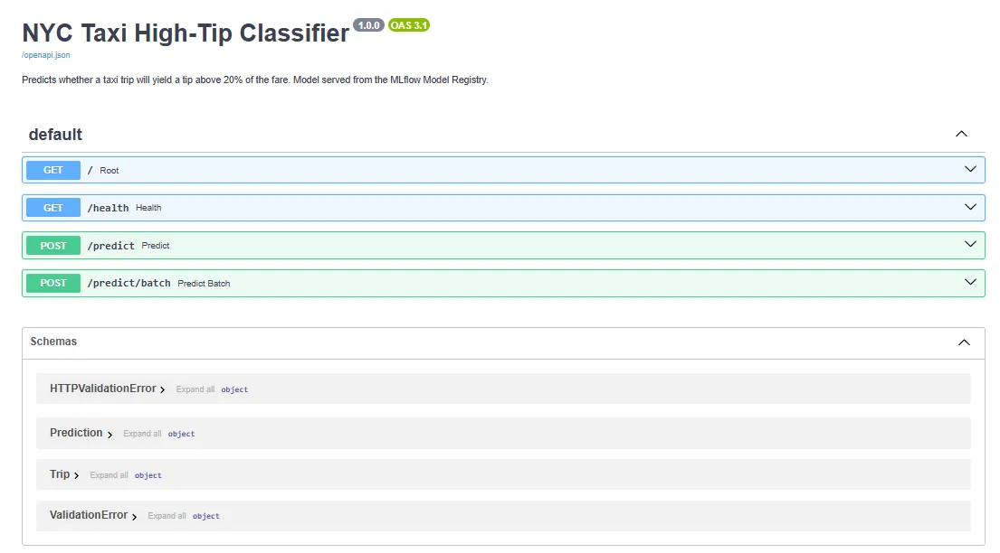

**`/predict` — request body filled in**
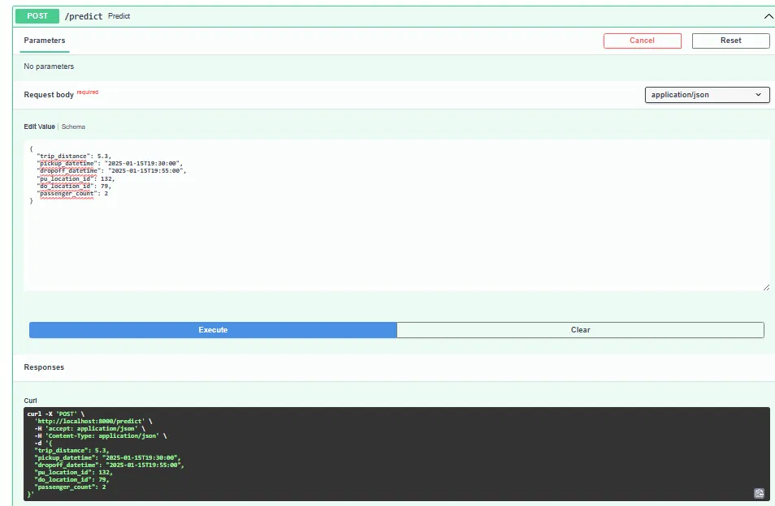

**`/predict` — successful response (HTTP 200)**
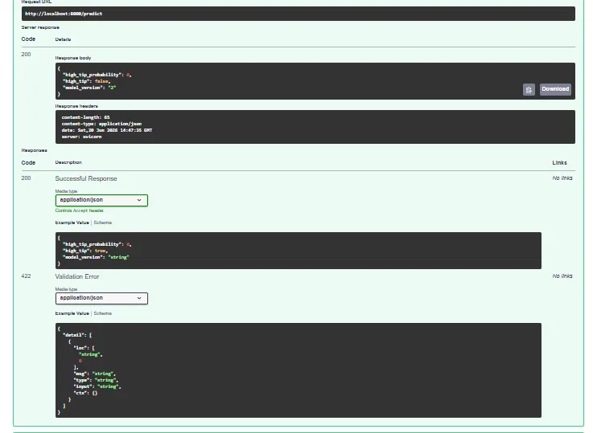

---

## Data-drift monitoring (Evidently)

The monitoring layer compares the 2024 reference population against the 2025
current population and writes both an HTML report and a machine-readable
`drift_summary.json` the dashboard reads. It correctly flags the payment-type
shift while reporting the model's own features as stable.

**Drift summary — 1 of 8 columns drifted**
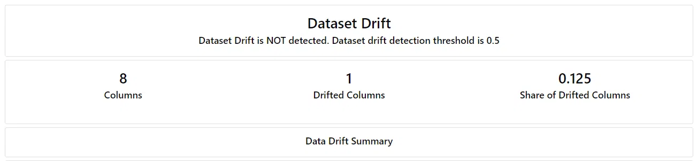

**Per-column drift — payment-type drift detected (Jensen-Shannon distance)**
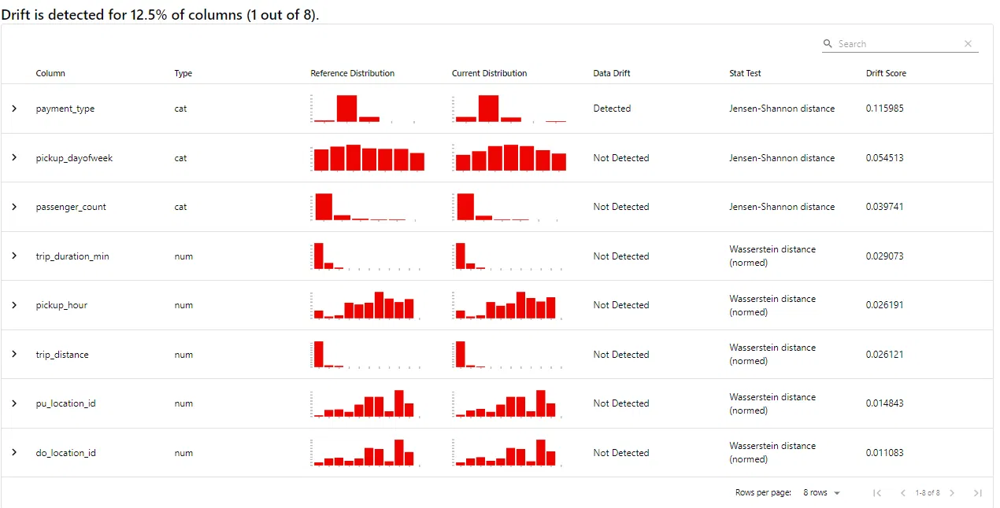

---

## Operations dashboard (Streamlit)

A single console that ties the system together: the champion's model card and
registry history, the live drift status, and an interactive prediction form
that uses the running API when available and falls back to the champion model
otherwise.

**Drift monitoring panel**
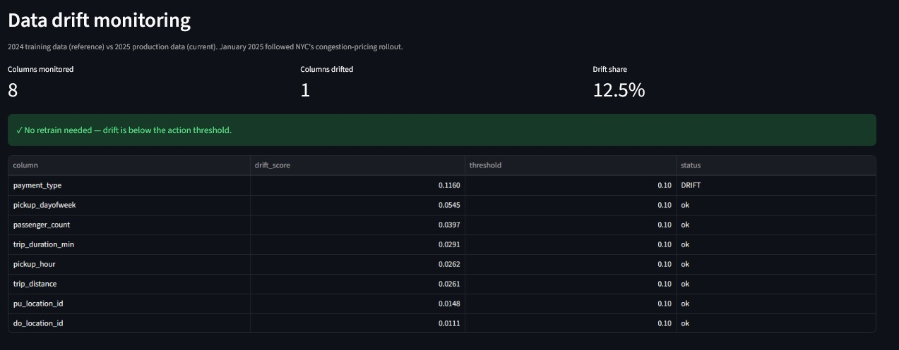

**Live prediction form**
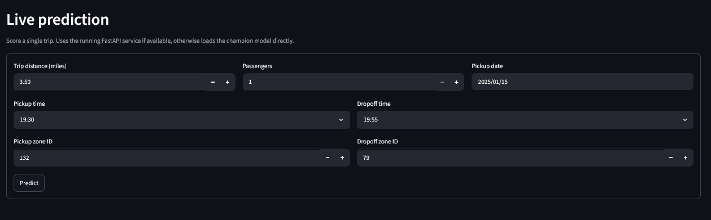

---

## Tech stack

Python 3.11 · pandas · scikit-learn · XGBoost · **MLflow** (tracking +
registry) · **Feast** · **Evidently** · **FastAPI** + Uvicorn · **Docker
Compose** · **GitHub Actions** · Streamlit · Plotly.

---

## Repository layout

```
nyc-tip-mlops/
├── build_features.py            # raw parquet -> leakage-free feature table
├── build_monitoring_snapshot.py # full-population snapshots for drift
├── training/
│   ├── train.py                 # baseline trainer
│   └── train_v2.py              # richer features + hyperparameter search
├── serving/
│   └── app_api.py               # FastAPI serving the champion model
├── monitoring/
│   └── check_drift.py           # Evidently drift report + summary JSON
├── dashboard/
│   └── app_dashboard.py         # Streamlit operations console
├── tests/
│   ├── test_features.py         # unit tests (feature logic, target)
│   └── make_sample_data.py      # small synthetic sample for CI
├── .github/workflows/ci.yml     # tests on push + scheduled retrain
├── Dockerfile.api               # API image
├── docker-compose.yml           # API + MLflow UI
├── requirements.txt             # full project deps
└── requirements-api.txt         # slim deps for the API container
```

---

## How to run it locally

> Data files and the MLflow store are gitignored (they are large and
> machine-specific). The steps below regenerate everything from scratch.
> Several components are long-running servers (MLflow UI, the API, the
> dashboard) — run each of those in its **own terminal**, with the conda
> environment activated.

### 1. Environment and folders

```bash
conda create -n mlops python=3.11 -y
conda activate mlops
pip install -r requirements.txt

# These folders are gitignored (only their contents), so create them on a
# fresh clone before downloading data or writing features.
mkdir -p data features monitoring
```

### 2. Get the data

```bash
curl -o data/yellow_tripdata_2024-01.parquet \
  https://d37ci6vzurychx.cloudfront.net/trip-data/yellow_tripdata_2024-01.parquet
curl -o data/yellow_tripdata_2025-01.parquet \
  https://d37ci6vzurychx.cloudfront.net/trip-data/yellow_tripdata_2025-01.parquet
```

### 3. Build features

```bash
python build_features.py data/yellow_tripdata_2024-01.parquet features/train.parquet
python build_features.py data/yellow_tripdata_2025-01.parquet features/prod.parquet
```

### 4. Train (logs to MLflow, registers + promotes the champion)

```bash
python training/train_v2.py
```

This trains the model, logs everything to MLflow (`mlflow.db` + `mlruns/`),
and promotes the best run to the `champion` alias. To browse the runs and
the registry, start the MLflow UI **in a separate terminal** (it stays
running):

```bash
mlflow server --backend-store-uri sqlite:///mlflow.db --host 127.0.0.1 --port 5000
# open http://localhost:5000
```

### 5. Serve the model (separate terminal)

```bash
uvicorn serving.app_api:app --port 8000
# open http://localhost:8000/docs
```

### 6. Monitor drift

```bash
python build_monitoring_snapshot.py data/yellow_tripdata_2024-01.parquet monitoring/ref_snapshot.parquet
python build_monitoring_snapshot.py data/yellow_tripdata_2025-01.parquet monitoring/cur_snapshot.parquet
python monitoring/check_drift.py
# open monitoring/drift_report.html
```

### 7. Dashboard (separate terminal)

```bash
streamlit run dashboard/app_dashboard.py
```

### 8. Everything in Docker

Requires steps 1–4 first, so that `mlflow.db` and `mlruns/` exist (they are
mounted into the containers). Then:

```bash
docker compose up --build
# API docs : http://localhost:8000/docs
# MLflow UI: http://localhost:5000
```

---

## CI/CD

`.github/workflows/ci.yml` defines two jobs:

- **test** — runs the unit-test suite on every push and pull request.
- **retrain** — on a weekly schedule (and on demand via *Run workflow*),
  regenerates a small synthetic sample, runs the full training + MLflow
  logging + registry-promotion path, and uploads the model artifacts.
  This demonstrates the automated-retraining loop that closes the MLOps
  cycle without depending on the large external dataset.

---

## Notes

- The honest, leakage-free framing keeps validation AUC modest (~0.62);
  the project's value is the surrounding MLOps engineering, not the score.
- Streamlit Cloud cannot run Docker/FastAPI, so the deployed dashboard
  loads the champion model directly and falls back gracefully when the API
  is not reachable.
