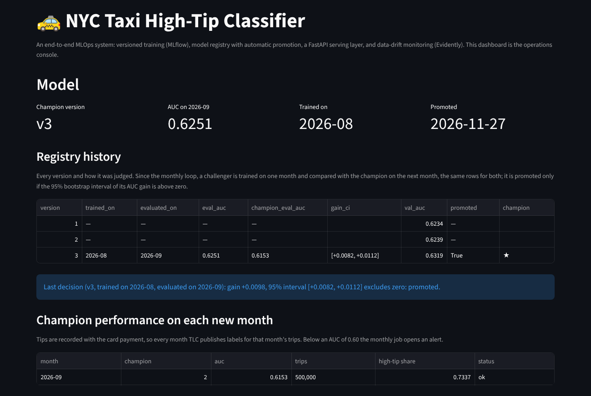
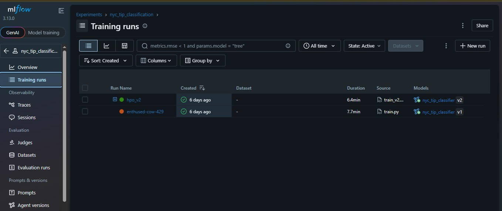
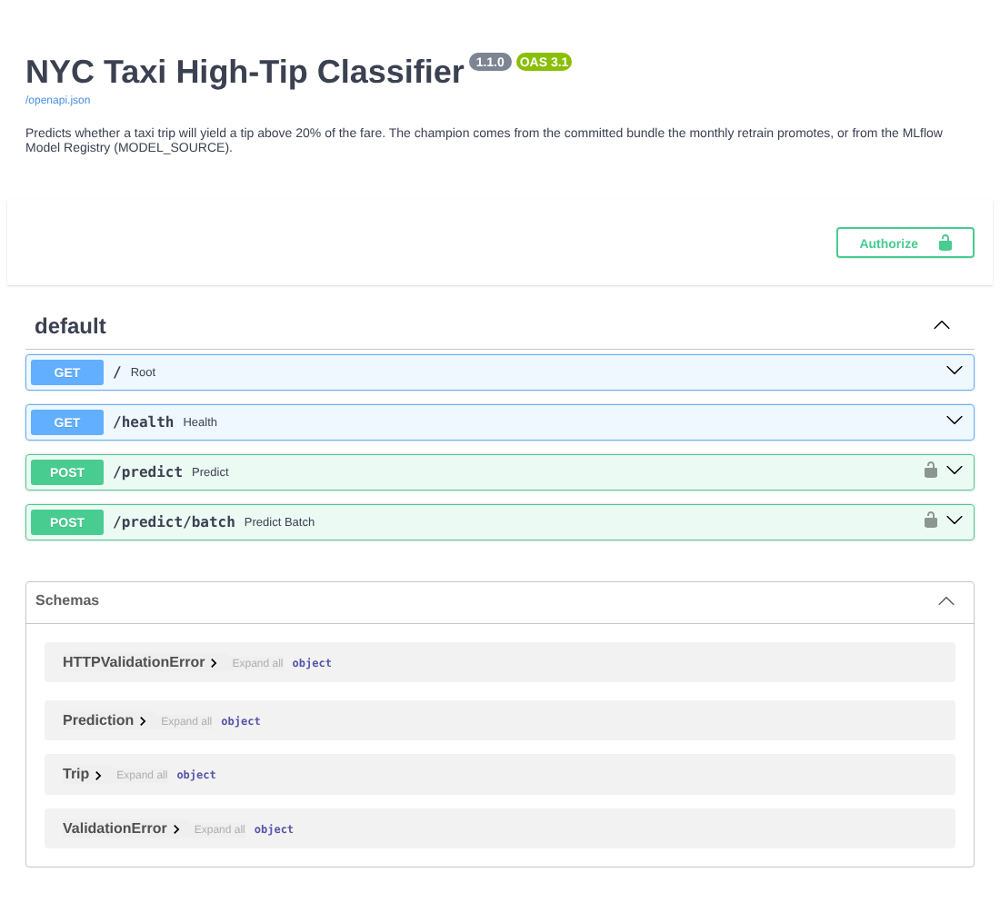
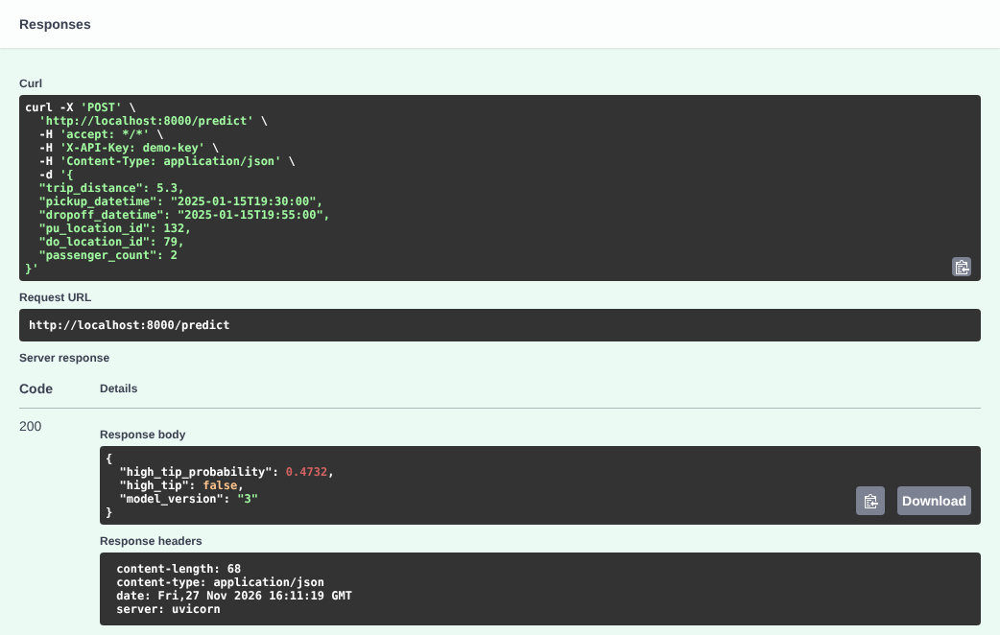
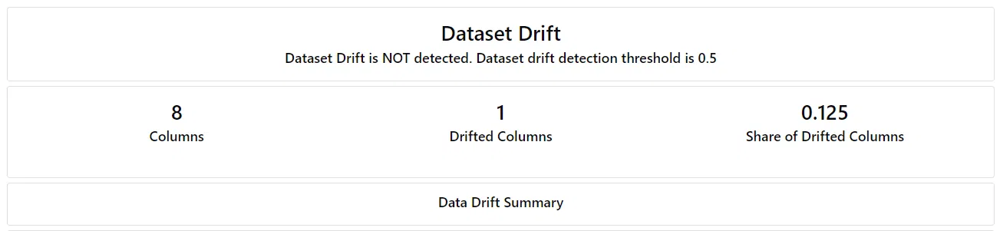
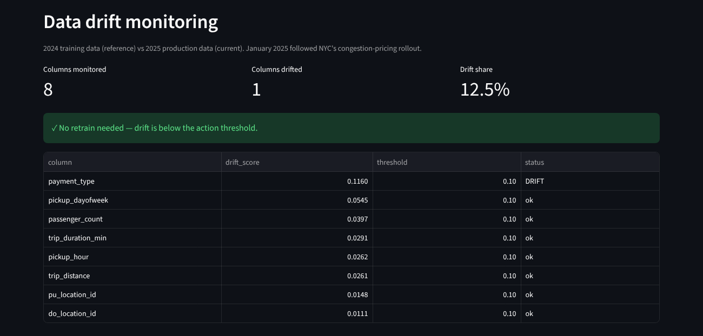

# NYC Taxi High-Tip Classifier — End-to-End MLOps

[](https://github.com/DiegoTDDD/nyc-tip-mlops/actions/workflows/ci.yml)
[](LICENSE)

**Problem.** A model is only useful in production if every step around it can be trusted: training that can be repeated, a clear rule for which version is live, a service that computes features exactly as training did, and a signal when the data changes.

**Solution.** An end-to-end MLOps system around a classifier that predicts, when a NYC taxi ride ends and before the rider pays, whether the tip will be more than 20% of the fare. Every month it retrains on the newest real TLC data, compares the challenger with the champion on the same out-of-time month, promotes only a gain larger than the bootstrap noise, records the champion's performance and raises an alert when it drops. Around that: MLflow tracking and registry, a FastAPI service with an API key, Evidently drift monitoring, a Streamlit operations dashboard and CI that runs the whole loop, including Docker.

- **Live dashboard:** [nyc-tip-mlops.streamlit.app](https://nyc-tip-mlops.streamlit.app/)
- **Design decisions:** [`docs/adr/`](docs/adr/README.md)
- **Author:** Diego Leonardo Alves de Andrade



---

## Results

| | |
|---|---|
| Champion | `nyc_tip_classifier` v3 (XGBoost), trained on August 2026, promoted by the monthly loop |
| AUC on September 2026 | **0.625** against 0.615 for v2 (trained on January 2024), same 500,000 trips; gain interval [+0.008, +0.011] |
| Why modest | The honest ceiling without label leakage; see [ADR 0001](docs/adr/0001-no-label-leakage.md) |
| Promotion rule | Same out-of-time month for both models; promoted only if the 95% paired-bootstrap interval of the gain is above zero ([ADR 0006](docs/adr/0006-promotion-on-a-shared-out-of-time-month.md)) |
| Monthly loop | Newest TLC month found, champion's AUC recorded, challenger trained on the month before, decision committed, alert under AUC 0.60 ([ADR 0007](docs/adr/0007-monthly-retrain-loop.md)) |
| Drift, Jan 2024 to Jan 2025 | Model features stable; `payment_type` drifted ("unknown" share 4% to 13%) |
| Tests | 42: the feature code, the training-vs-API feature check, the promotion rule and its bootstrap, the monthly loop, reproducible training, a real MLflow registry, serving from the committed bundle, every API endpoint and the API key |
| CI | Lint, tests, an exact-versions install and API call, the Docker Compose stack, a monthly retrain on real data, a Windows run, a security audit and a live-app check |

The project's value is the engineering around the model, not the score: tipping is hard to predict from trip data, and the leakage-free framing keeps AUC modest on purpose.

---

## Architecture

```
NYC Taxi parquet (2024 train / 2025 production)
        │
        ▼
  Feature engineering  ──►  features/train.parquet      (model features, no leakage)
        │                   monitoring/*_snapshot.parquet (full population for drift)
        ▼
  Training (XGBoost)  ──►  MLflow tracking + registry  ──►  champion alias
        │
  Monthly loop (retrain.yml): newest TLC month ─► champion AUC ─► challenger on the month before
        │                     ─► paired bootstrap on the same rows ─► serving_model/ + history
        │                        │
        │                        ▼
        │                  FastAPI /predict  (loads champion from registry)
        ▼
  Evidently drift report  ──►  monitoring/drift_summary.json
        │
        ▼
  Streamlit dashboard  (metrics + registry + drift + live prediction)

  Docker Compose: API (8000) + MLflow UI (5000)
  GitHub Actions: tests + Docker test on push, monthly retrain on real data, security audit, app health
```

---

## The problem and the data

The model predicts, when a trip ends and before payment, whether the rider will
tip more than 20% of the fare. That is the moment the payment screen in the cab
offers tip choices, and every feature the model uses is known by then. The data is the public NYC TLC Yellow Taxi
trip records: **January 2024** as the training reference and **January
2025** as the production/drift period (the month following NYC's
congestion-pricing rollout).

### Modeling honesty (no leakage)

Cash trips almost never record a tip, so `payment_type` trivially predicts
"no tip". Leaving it in would produce a deceptively high score that any
reviewer would recognize as leakage. Instead the model trains **only on
credit-card trips** and never sees the payment channel. It must predict
*who* tips well from trip characteristics known when the ride ends: distance,
duration, hour, day of week, passenger count, and pickup/dropoff zone.

This is a genuinely hard signal — tipping is idiosyncratic — so the honest
ceiling is low (validation AUC ≈ 0.62). The hyperparameter search confirmed
that deeper, larger models *overfit* and generalized worse, which is itself
evidence that the simple model is the right one. In a portfolio context an
honest 0.62 with a clean pipeline is worth more than a leaky 0.99.

### Features

| Feature | Notes |
|---|---|
| `trip_distance` | miles |
| `trip_duration_min` | from pickup/dropoff timestamps |
| `avg_speed_mph` | distance / duration, capped at 80 |
| `passenger_count` | riders in the trip |
| `pickup_dayofweek`, `is_weekend` | calendar features |
| `hour_sin`, `hour_cos` | cyclical encoding of pickup hour |
| `pu_zone_tip_rate`, `do_zone_tip_rate` | smoothed target-encoding of zones, **fit on the training split only** to avoid leakage |

---

## Versioned training & model registry (MLflow)

Every training run is logged to MLflow with its parameters, metrics, and
diagnostic plots. `train_v2.py` registers each new version of
`nyc_tip_classifier`, scores it and the current champion on the same holdout
file, and moves the `champion` alias to it only if the gain is above the
bootstrap noise ([ADR 0006](docs/adr/0006-promotion-on-a-shared-out-of-time-month.md)).
That alias is what the serving layer loads, so promotion is the single source
of truth for "what's in production". The baseline `train.py` logs to the same experiment for
comparison but never registers, because its inputs differ from what the API
sends ([ADR 0002](docs/adr/0002-one-registered-model-strict-promotion.md)).

**Training runs — versions, sources, and registered models**


The richer trainer runs a 12-combination hyperparameter search, each
combination logged as a nested child run so they can be compared side by side.

**Hyperparameter-search run — metrics and nested child runs**


**Local MLflow registry (experiments) — the `champion` alias points at the best version; the deployed champion is the committed bundle above**


---

## Monthly retraining on real data

Tips are recorded with the card payment, so every month TLC publishes labels for that month's
trips. `training/retrain.py` uses that, and `.github/workflows/retrain.yml` runs it on the 20th
of each month ([ADR 0007](docs/adr/0007-monthly-retrain-loop.md)):

1. Find the newest month TLC has published (it publishes about two months late).
2. Score the champion in `serving_model/` on it and append the AUC to
   `monitoring/performance_history.json`. Under 0.60, open a GitHub issue.
3. Train a challenger on the month before, with the same hyperparameter search.
4. Score both on the same 500,000 trips of the newest month and promote only if the 95%
   paired-bootstrap interval of the AUC gain is above zero.
5. On promotion, rewrite the bundle the API and the dashboard read; either way, append the
   decision (months, both AUCs, interval, row fingerprint, reason) to
   `serving_model/registry_history.json`, and commit.

The first run, evaluated on September 2026, replaced the January 2024 model:

| | Trained on | AUC on Sep 2026 |
|---|---|---|
| v2 (old champion) | January 2024 | 0.6153 |
| v3 (new champion) | August 2026 | **0.6251** |
| Gain, 95% interval | | +0.0098 [+0.0082, +0.0112] |

---

## Serving the champion (FastAPI)

The API loads the champion from the committed `serving_model/` bundle the monthly loop
promotes (`MODEL_SOURCE=bundle`, the registry of record), from the MLflow registry's
`champion` alias (`MODEL_SOURCE=mlflow`, the Docker stack and local experiments), or, when
unset, from MLflow with the bundle as fallback; `/` reports which. It builds the
features with the same module training uses (`nyc_tip/features.py`), so a raw
trip in equals the training feature row; a test checks this on 60 random trips.
It loads the native XGBoost model and returns `predict_proba`
([ADR 0003](docs/adr/0003-shared-features-native-model-serving.md)). It exposes `/`, `/health`, `/predict`,
and `/predict/batch`. With `API_KEY` set, the prediction endpoints require the header
`X-API-Key` (401 otherwise); `/` and `/health` stay open for probes.

**Interactive API docs — the four endpoints**


**`/predict` — request body filled in, authorized with the `X-API-Key` header**


**`/predict` — successful response (HTTP 200)**


---

## Data-drift monitoring (Evidently)

The monitoring layer compares the 2024 reference population against the 2025
current population and writes both an HTML report and a machine-readable
`drift_summary.json` the dashboard reads. It correctly flags the payment-type
shift while reporting the model's own features as stable.

**Drift summary — 1 of 8 columns drifted**


**Per-column drift — payment-type drift detected (Jensen-Shannon distance)**


---

## Operations dashboard (Streamlit)

A single console that ties the system together: the champion's model card and
registry history, the live drift status, and an interactive prediction form
that uses the running API when available and falls back to the champion model
otherwise.

**Drift monitoring panel**


**Live prediction form**


---

## Design decisions

| Decision | Why |
|---|---|
| [Credit-card trips only; zone encodings fit on the training split](docs/adr/0001-no-label-leakage.md) | Cash trips would leak the label; encodings fit on all rows would leak validation |
| [Only train_v2 registers; strict promotion](docs/adr/0002-one-registered-model-strict-promotion.md) | The champion must always accept the features the API sends |
| [Shared feature module; native XGBoost serving](docs/adr/0003-shared-features-native-model-serving.md) | Removes three copies of the feature code, and makes the API return a real probability |
| [Local MLflow and a committed champion bundle](docs/adr/0004-local-mlflow-and-deploy-bundle.md) | Free, reproducible, and the public dashboard still works without the store |
| [Drift report](docs/adr/0005-drift-report-not-auto-retrain.md) | The column that drifted is not a feature; the report stays as a diagnostic |
| [Promotion on the same newest month, beyond the noise](docs/adr/0006-promotion-on-a-shared-out-of-time-month.md) | Two AUCs from different splits cannot be compared, and a tiny gain can be luck |
| [Monthly retrain on real data](docs/adr/0007-monthly-retrain-loop.md) | Labels arrive each month with the card payments, so the loop can close on real data |

---

## Limitations

- **Modest signal.** AUC 0.62-0.63. Tipping depends on people, not trips, and the model sees only trip data.
- **One month ahead.** The newest month stands in for next month's traffic; a change within a month shows only at the next run.
- **Single machine registry.** Local MLflow (SQLite and files) for experiments, the committed bundle as the record for production. A team would use a shared MLflow server or a model registry service.
- **API key, not identity.** One shared key; no per-user authentication or rate limiting.

---

## Tech stack

Python 3.11 · pandas · scikit-learn · XGBoost · **MLflow** (tracking +
registry) · **Evidently** · **FastAPI** + Uvicorn · **Docker
Compose** · **GitHub Actions** · Streamlit · Plotly.

---

## Repository layout

```
nyc-tip-mlops/
├── nyc_tip/
│   ├── features.py              # the only feature code: cleaning, target, encodings, API row
│   └── promotion.py             # paired bootstrap of the AUC gain, fingerprint, decision
├── build_features.py            # raw parquet -> leakage-free feature table
├── build_monitoring_snapshot.py # full-population snapshots for drift
├── inspect_data.py              # quick look at the raw TLC files (schema, row counts)
├── export_for_deploy.py         # exports the champion into serving_model/
├── serving_model/               # versioned champion bundle used by Streamlit Cloud
├── training/
│   ├── train.py                 # baseline (logged for comparison, never registered)
│   ├── train_v2.py              # features + hyperparameter search + registry promotion
│   └── retrain.py               # the monthly loop on the committed bundle
├── serving/
│   └── app_api.py               # FastAPI serving the champion model
├── monitoring/
│   ├── check_drift.py           # Evidently drift report + summary JSON
│   └── performance_history.json # the champion's AUC on each new month
├── dashboard/
│   ├── app_dashboard.py         # Streamlit operations console
│   └── requirements.txt         # slim deps for Streamlit Cloud
├── tests/                       # pytest: features, promotion, monthly loop, training + registry, API
├── specs/                       # Spec Kit: specification, plan and tasks per feature
├── docs/
│   ├── adr/                     # architecture decision records
│   └── screenshots/             # images used in this README
├── .github/                     # CI, Windows check, security audit, app health
├── Dockerfile.api               # API image
├── docker-compose.yml           # API + MLflow UI
├── pyproject.toml               # project metadata, pytest and ruff settings
├── requirements.txt             # full project deps
└── requirements-api.txt         # slim deps for the API container
```

---

## How to run it locally

> Data files and the MLflow store are gitignored (they are large and
> machine-specific). The steps below regenerate everything from scratch.
> Several components are long-running servers (MLflow UI, the API, the
> dashboard) — run each of those in its **own terminal**, with the conda
> environment activated.

### 1. Environment and folders

```bash
conda create -n mlops python=3.11 -y
conda activate mlops
pip install -r requirements.txt

# These folders are gitignored (only their contents), so create them on a
# fresh clone before downloading data or writing features.
mkdir -p data features monitoring
```

### 2. Get the data

```bash
curl -o data/yellow_tripdata_2024-01.parquet \
  https://d37ci6vzurychx.cloudfront.net/trip-data/yellow_tripdata_2024-01.parquet
curl -o data/yellow_tripdata_2025-01.parquet \
  https://d37ci6vzurychx.cloudfront.net/trip-data/yellow_tripdata_2025-01.parquet
```

### 3. Build features

```bash
python build_features.py data/yellow_tripdata_2024-01.parquet features/train.parquet
python build_features.py data/yellow_tripdata_2025-01.parquet features/prod.parquet
```

### 4. Train (logs to MLflow, registers + promotes the champion)

```bash
python training/train_v2.py --holdout features/prod.parquet
```

This trains the model, logs everything to MLflow (`mlflow.db` + `mlruns/`),
scores it and the current champion on the January 2025 trips (which neither
trained on), and promotes it to the `champion` alias if the gain is above the
bootstrap noise; the first run always becomes champion. To browse the runs and
the registry, start the MLflow UI **in a separate terminal** (it stays
running):

```bash
mlflow server --backend-store-uri sqlite:///mlflow.db --host 127.0.0.1 --port 5000
# open http://localhost:5000
```

### 5. Serve the model (separate terminal)

```bash
uvicorn serving.app_api:app --port 8000
# open http://localhost:8000/docs
```

### 5b. The monthly loop (optional; downloads two months)

```bash
python training/retrain.py --eval-month 2026-09   # trains on 2026-08, compares on 2026-09
```

### 6. Monitor drift

```bash
python build_monitoring_snapshot.py data/yellow_tripdata_2024-01.parquet monitoring/ref_snapshot.parquet
python build_monitoring_snapshot.py data/yellow_tripdata_2025-01.parquet monitoring/cur_snapshot.parquet
python monitoring/check_drift.py
# open monitoring/drift_report.html
```

### 7. Dashboard (separate terminal)

```bash
streamlit run dashboard/app_dashboard.py
```

### 8. Everything in Docker

Requires steps 1–4 first, so that `mlflow.db` and `mlruns/` exist (they are
mounted into the containers). Then:

```bash
docker compose up --build
# API docs : http://localhost:8000/docs
# MLflow UI: http://localhost:5000
```

Both ports are published on `127.0.0.1` only, so the API and the MLflow UI are not
reachable from other machines on your network.

`mlflow.db` records the absolute path of the folder where the model was trained. That
folder does not exist inside the container, so when the registered path is missing the
API loads the same files from `./mlruns` (mounted at `/app/mlruns`). The *Docker compose
stack* job in CI checks this on every push.

> **Upgrading from MLflow 3.13 – 3.15?** MLflow 3.16 and later fix the AI Gateway SSRF advisory (GHSA-h7x2-h6g9-p789) that affected 3.13.0 – 3.15.2. The newer versions upgrade the SQLite registry (`mlflow.db`) automatically the first time they open it, and older MLflow versions refuse to open an upgraded database (`Detected out-of-date database schema`). Back up `mlflow.db`, then update every environment together: `pip install -r requirements.txt` and `docker compose up --build`.

### Run the tests

```bash
pytest
```

The suite trains two small models into a temporary MLflow store, so it needs the full `requirements.txt` but no data download.

---

## CI/CD

`.github/workflows/ci.yml` defines three jobs:

- **test** — `ruff` (type hints required in `nyc_tip/`, `training/`, `serving/` and `monitoring/`, and no `print` there) and the 42 tests, on every push and pull request.
- **pinned** — installs exactly `requirements.txt` (the documented versions), runs
  `pip check`, trains on the sample data, starts the API and calls `/health` and
  `/predict` (the answer must be a probability strictly between 0 and 1). This is what proves a dependency bump (for example MLflow)
  still works.
- **docker** — trains a sample model on the runner, runs `docker compose up --build`,
  waits for the API and the MLflow UI, calls `/predict` and checks that the published
  ports are bound to `127.0.0.1`.
Three more workflows run next to it:

- `retrain.yml` runs the monthly loop on real TLC data on the 20th of each month (and on
  demand), checks that a promoted bundle loads and predicts, commits the decision and the
  histories, and opens a `model-alert` issue when the champion is under the floor.
- `security-audit.yml` audits every `requirements*.txt` with `pip-audit` whenever
  dependencies change and every Monday. It fails only when a vulnerable package has a
  fixed version available.
- `app-health.yml` opens the [live dashboard](https://nyc-tip-mlops.streamlit.app) in a
  real browser after each push and once a day (waking it if it was asleep) and fails if
  the app shows an error.
